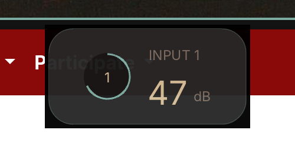

# Scarlett Gain Overlay

A compact, always-on-top gain HUD for the **Focusrite Scarlett 2i2 4th Gen**, written in Zig.



It communicates directly with the Scarlett over USB—Focusrite Control is not inspected or required.

- macOS and Linux (X11/XWayland)
- 75 ms gain polling
- 1.9 second hold followed by a 0.55 second fade
- Click-through, non-focusing overlay
- Automatically follows the active Omarchy theme via `colors.toml`
- Device `1235:8219`, firmware 2115 or newer

## Requirements

- Zig 0.16
- libusb 1.0 development files
- OpenGL and X11 development files on Linux

GLFW and stb_truetype are vendored with their respective licenses. Inter is distributed under the SIL Open Font License.

## macOS

```sh
brew install zig libusb
./scripts/install-macos.sh
open "/Applications/Scarlett Gain Overlay.app"
```

The installer also adds a per-user LaunchAgent so the overlay starts automatically after login. The app has no Dock icon. To stop it:

```sh
launchctl bootout gui/$(id -u)/dev.saiem.scarlett-gain-overlay
```

## Linux

Debian/Ubuntu:

```sh
sudo apt install libusb-1.0-0-dev libgl1-mesa-dev \
  libx11-dev libxrandr-dev libxi-dev libxcursor-dev libxinerama-dev
sudo install -m 0644 packaging/linux/70-scarlett-gain-overlay.rules /etc/udev/rules.d/
sudo udevadm control --reload-rules
sudo udevadm trigger
zig build -Doptimize=ReleaseSafe
./zig-out/bin/scarlett-gain-overlay
```

Arch/Omarchy:

```sh
sudo pacman -S --needed zig libusb mesa libx11 libxrandr libxi libxcursor libxinerama
zig build -Doptimize=ReleaseSafe
./scripts/run-hyprland.sh
```

The Hyprland launcher registers a floating, pinned, non-focusing window rule before starting the overlay.

### Omarchy theme integration

On Linux the app reads:

```text
~/.local/state/omarchy/current/theme/colors.toml
```

It uses the theme's `background`, `darker_background`, `foreground`, `dark_foreground`, and `accent` values. Restart the app after changing themes, or invoke it from an Omarchy `theme-set.d` hook.

## Testing the UI without hardware

```sh
zig build run -- --demo
# Hyprland:
./scripts/run-hyprland.sh --demo
```

## Notes

- Close Focusrite Control before launching; the vendor-control interface is exclusive.
- Only read commands are issued after the device initialization handshake.
- Protocol framing and Gen 4 offsets follow Linux's upstream `sound/usb/mixer_scarlett2.c` driver.

## License

MIT. Third-party components retain their own licenses.
